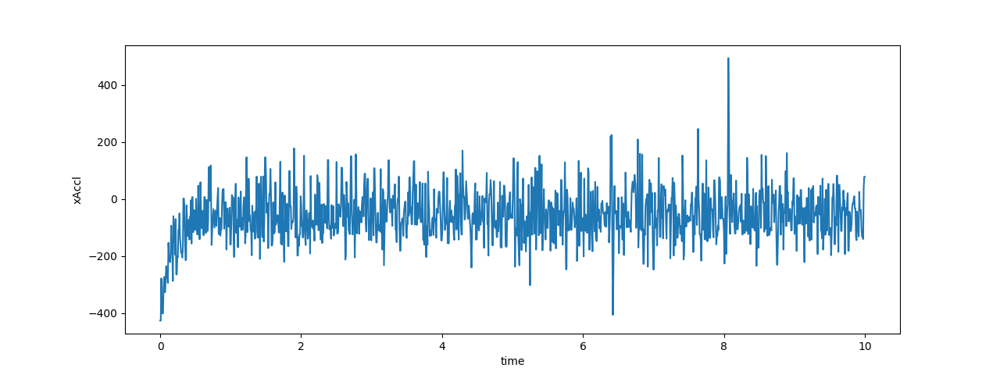
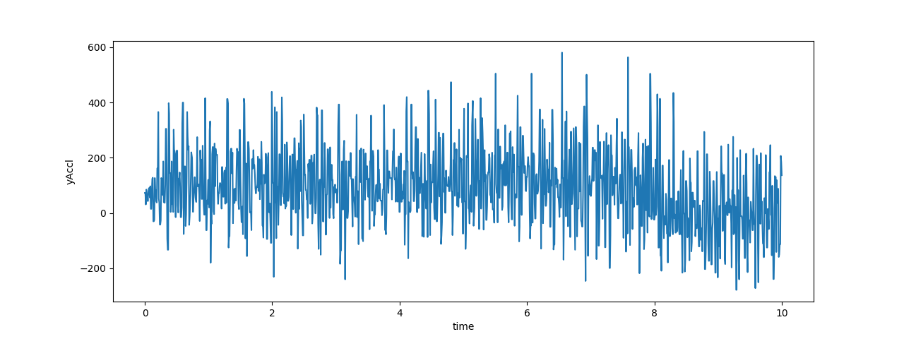

## Methodology and Results

Based on the results of our machine learning model, we have determined that the second activity dataset in our testing data is the trace of the car driving.
Because the car is driving on a flat plane, we can ignore the z-axis acceleration and use the x-axis and y-axis acceleration to determine the speed of the car.
Using the accelerations values, we can then simply integrate the values to arrive at a value for the speed of the car.
Note that due to the positioning of the accelerometer, the forward x direction is actually pointing backwards. Through integration we find (speed is in terms of seconds but distance unit is unknown): $$\text{x speed = 581.9}$$ $$\text{y speed = 910.58}$$

